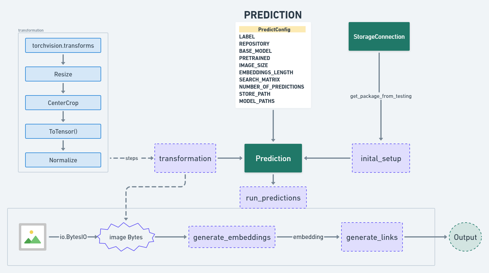

# **Prediction Endpoint**

This repository is the **Prediction Endpoint**, the final part of the **De-Coupled Microservice Architecture** for the **Image Similarity Search System**. The primary role of this endpoint is to take an **input image**, generate its embeddings, and perform **similarity search** using an ANN (Approximate Nearest Neighbors) algorithm to return URLs of visually similar images.

---

## **Overview**

The **Prediction Endpoint** performs the following tasks:

1. **Input Image Transformation**:  
   Preprocesses the user-provided input image using transformations like resizing, cropping, and normalization.

2. **Embedding Generation**:  
   Passes the transformed image through the **trained model** to generate its embedding.

3. **Similarity Search**:  
   Searches for visually similar images by comparing the embedding with precomputed embeddings using the **ANN algorithm**.

4. **Output URLs**:  
   Returns a set of URLs of similar images stored in MongoDB, enabling users to view the results.

---

## **Workflow**

### **Prediction Process**

The following steps describe the end-to-end process for predicting similar images:

**Flowchart**:  


1. **Input Image**:  
   - The user uploads an image in the frontend interface.  
   - The image is read as bytes using `io.BytesIO`.

2. **Image Transformation**:  
   - Apply the following transformations using **`torchvision.transforms`**:
     - **Resize**: Adjust the image to a predefined size.  
     - **CenterCrop**: Crop the center region of the image.  
     - **ToTensor**: Convert the image into a tensor format.  
     - **Normalize**: Scale pixel values for consistent input.  

3. **Embedding Generation**:  
   - Load the **trained model** from the S3 bucket.  
   - Generate an embedding vector for the transformed image.

4. **Similarity Search**:  
   - Use the embedding to search for visually similar images using the **ANN algorithm**.  
   - Embeddings and corresponding metadata (e.g., image URLs) are retrieved from MongoDB and the precomputed ANN file.

5. **Generate Links**:  
   - Retrieve and return the URLs of similar images.  

6. **Output**:  
   - The system outputs the URLs of similar images, which can be viewed in a browser.

---

## **Key Components**

### **1. PredictConfig**
   - Configuration file containing essential parameters:  
     - `MODEL_PATHS`: Path to the trained model in S3.  
     - `EMBEDDINGS_LENGTH`: Dimension of the embeddings.  
     - `SEARCH_MATRIX`: ANN search index path.  
     - `NUMBER_OF_PREDICTIONS`: Number of similar images to return.  

### **2. Input Image Transformation**
   - The input image is transformed using:  
     - **Resize**  
     - **CenterCrop**  
     - **ToTensor()**  
     - **Normalize**  

   - These transformations ensure compatibility with the trained model.

### **3. Embedding Generation**
   - The transformed image is passed through the **trained ResNet18 model** to generate embeddings of 384 dimensions.  

### **4. Similarity Search**
   - The **ANN algorithm** is used to perform similarity search in **O(logn)** time.  
   - Precomputed embeddings and metadata are retrieved from MongoDB.

### **5. Output**
   - URLs of similar images are returned in response, enabling users to view the results.

---

## **Technologies Used**

- **Python**  
- **PyTorch**: Deep Learning framework for model inference  
- **Torchvision**: Image preprocessing transformations  
- **ANN (Annoy)**: Efficient Approximate Nearest Neighbors search  
- **AWS S3**: Storage for the trained model and ANN artifacts  
- **MongoDB**: Metadata storage for image URLs and labels  
- **FastAPI**: Backend framework for API deployment  

---

## **Setup Instructions**

```bash
1. **Clone the Repository**:  
   git clone <repo-link>
   cd prediction-endpoint

2. **Install Dependencies**:  
   pip install -r requirements.txt

3. **Environment Configuration**:  
   - Configure S3 bucket credentials in a `.env` file.  
   - Set MongoDB connection strings and ANN index paths.

4. **Run the Prediction Server**:  
   python app.py
